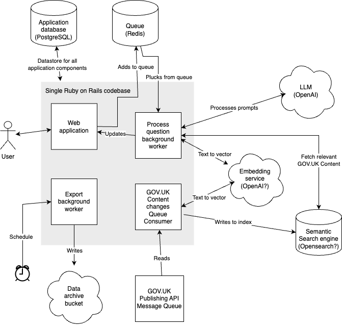

# 1. Pilot Technical Architecture

Date: 2024-03-25

## Context

In February 2024, following successful prototyping, it was decided that GOV.UK Chat would be developed for a public pilot and thus form a part of GOV.UK's production stack. This left us with a decision about how we would architect the application for this stack.

The prototype was based upon two codebases:

- [govuk-chat-prototype](https://github.com/alphagov/govuk-chat-prototype) (private repo) - A Ruby on Rails application, hosted on Heroku, that performs frontend rendering. Which uses PostgreSQL for storing user questions and answers and a Redis database to queue asychnronous jobs to retrieve answers.
- [govuk-chat-api](https://github.com/alphagov/govuk-chat-api) (private repo) - A Python FastAPI application built, hosted on Google Cloud Platform (GCP), using the LangChain framework that provides an API to generate answers to questions. This uses PostgreSQL for storing user questions and answers, a Qdrant database for semantic search and communicates with the OpenAI API for accessing a Large Language Model (LLM).

We then identified a number of goals for the pilot.

Keep software architecture simple:

- We’re going to be dealing with new technology with LLMs, embedding models and vector datastores - let’s not introduce other new technologies unless there’s a quantifiable gain, we will benefit more by only trailblazing in a few areas
- We may have to scale the product rapidly for the general public - let’s try minimise multiple things that’d need to be scaled in parallel

Prioritise this product’s immediate challenges over those of future products:

- With a variety of potential AI powered products it would seem prudent to develop tooling that can be shared, however this will complicate this product and without the actual use cases lead to tooling probably over tailored to this product
- Prefer solving shared challenges later when actual needs are defined

Prioritise production ready over ideal user experience:

- With a variety of external stakeholders, pressure could come rapidly at unexpected times, let’s ensure we nail the stuff that’s in our wheelhouse - reliable, scalable software - as early as possible so that the problems that aren’t as much in our wheelhouse - taming an LLM - are the ones left to resolve when the pressure is on - external stakeholders will understand better
- Resolving the ideal user experience is not a problem that can be quantified

Integrate with GOV.UK’s existing production infrastructure:

- We want this product to be supported easily by the rest of the GOV.UK technical community, we don’t want this team to have people on out of hours support
- Rather than relying on any pipelines in GCP we want to start with the production data feeds as a strong foundation for iteration, as adopting those earlier will make it harder to productionise them.

## Decision

We build the GOV.Chat Pilot as a single Ruby on Rails application using a single codebase, monolithic architecture, and we host it on the [GOV.UK Kubernetes platform](https://docs.publishing.service.gov.uk/kubernetes/#introduction).

The service will likely comprise of 4 processes:

- the user facing web application
- a background worker that converts questions to an answer
- a queue consumer that listens for changes to GOV.UK content and updates the search index
- an export worker that exports data to a cloud platform for posterity and further analysis

Supporting services are likely to be:

- a [PostgreSQL](https://www.postgresql.org/) database that is used for storing questions, answers and feedback. Data here would be stored for the duration of time that is useful for end users (PostgreSQL is GOV.UK’s most commonly used relational database)
- [Redis](https://redis.io/) to be used as a mechanism for queuing work for the background job (Redis is the GOV.UK conventional queuing technology for application background workers)
- [OpenAI](https://platform.openai.com/) to be used as the large language model for answer generation
- [OpenSearch](https://opensearch.org/) or a similar technology to provide a search interface
- An embedding model (likely one provided by OpenAI) to convert questions and GOV.UK content to vectors
- [GOV.UK Publishing API](https://docs.publishing.service.gov.uk/repos/publishing-api/rabbitmq.html) to provide a feed of content changes to GOV.UK Content
- A cloud storage solution (potentially an [S3 bucket](https://aws.amazon.com/s3/)) to store data for a longer term

As illustrated in the diagram below:

[Diagram source](https://drive.google.com/file/d/1v1VbVx-ygkK8OIb2qf6xB-Wt5k_m3bsT/view?usp=drive_link)

### Rationale

#### Single codebase vs a multiple services approach (e.g. Chat API and/or govuk-semantic-search)

It isn’t expected that GOV.UK chat is likely to become a significantly large application (e.g. something of millions of lines of code) and thus become an unwieldy codebase, therefore it is expected that the use of multiple services will provide an unnecessary extra level of complexity: more codebases to understand, coordinated changes for an application change, API abstractions to consider and a more complicated approach to scaling. Using a single codebase however should benefit the team, producing a faster development cycle and an easier route to iteration.

There is a case that the work for the search system could be useful in future AI applications as the same data may be required. We should avoid optimising for that now by making this a separate application (particularly due to GOV.UK’s purchase of Google Vertex AI as discussed below) however we should try modularise aspects of this to aid the option of this becoming a later abstraction. Risks of doing this abstraction too early would be: the search system ends up coupled to chat anyway, as the only tenant; the extra abstraction slows down development for the chat pilot; and we might not actually need it in future.

#### Choice of Ruby on Rails as application framework as opposed to a Python framework

GOV.UK has a long operational history with Ruby on Rails and has a number of libraries written for it that integrate it with aspects of the GOV.UK Kubernetes platform and frontend UI of the GOV.UK stack, using a Python framework would lack this. Generally, by convention we’re in a position where we have to justify a choice that isn’t Ruby on Rails as this is the expected platform for GOV.UK web tooling.

The GOV.UK support and on-call rota is populated by people with lots of experience in supporting Ruby on Rails GOV.UK apps written in similar ways, by adopting a different core language we would lose the ability for a wider pool of people to support the application.

As GOV.UK developers tend to have substantially more experience working with Ruby on Rails over Python, it is likely to lead to a substantially quicker development pace.

Although it is definitely acknowledged that Ruby is far less mature than Python in the facilities for data science work, we expect that the vast majority of data science will be performed by supporting services and that Ruby is sufficiently similar to Python that it will be a language that those familiar with Python can contribute to without substantial barriers (with a similar expectation that Python can be understood by developers more familiar with Ruby).

It is expected that this project should act as a test of whether using a Ruby on Rails project can produce both a fully feature rich AI based project and be a suitable environment that allows for collaboration between data scientists and developers.

#### Maintaining our own vector search rather than using GOV.UK’s Google Vertex AI search

GOV.UK has purchased [Google Vertex AI Search](https://cloud.google.com/enterprise-search?hl=en) as a technology to power GOV.UK Search, replacing a highly tuned Elasticsearch instance. Given Vertex AI Search is a product that is designed for use in RAG systems, and given that we are populating an index of GOV.UK content there, it is important to justify why it is not used in this architecture.

Our reason for not using is that the software is two fold:

1. At the current time the Vertex AI Search is not well understood and the GOV.UK integration is under active development, therefore it is not currently considered a stable platform
2. The AI team are exploring a number of fine tuning search in ways that may not be practical to apply to the entire GOV.UK Search and thus using Vertex AI Search is likely a downgrade in performance.

As a team we have a commitment to understand how GOV.UK’s use of Vertex AI Search develops so that it can be considered later for any future AI products, and potentially the future of this product. There is a very real chance of generating tech debt by this team having a complex search configuration that requires maintenance that is at all similar in the offering we receive from Google.

#### Using Publishing API message queue instead of a daily import from GOV.UK data’s Big Query

Listening to the Publishing API message queue provides the ability to get updates of content changes near instantly, whereas using the data in Big Query is potentially a number of days out of date.

The Publishing API message queue has been a stable piece of GOV.UK infrastructure for many years and it powers a number of essential GOV.UK services, such as Search and Email Alerts. This allows this to be a reliable tool to use with low risk of any data inaccuracies.

As per GOV.UK’s most recent [technical architecture goals (2020)](https://docs.google.com/document/d/1jEjPOFJ2s1cjQv9vHAbE-KF68LSletpnUVaG5lXlHy4/edit#heading=h.7wl302dfsee) it remains documented as the preferred way to consume GOV.UK content changes.

#### Exporting data out of the application rather than persisting it forever in the application database

It is expected that there will be a need to store the data generated by this application for a long period of time. This is for the purpose of further analysis and maintaining a log of how the system has behaved, in case of any liability issues.

The decision to export this data is to abstract this from being one of the concerns of the application itself and to avoid the need for analysis to be done via direct access to the application’s database.

Exporting the data also allows for the eventual removal of data when there is no longer a need to show the data in the user interface. This can help prevent the application database from being in a state of perpetual growth, as a large database can cause performance issues and can make it hard for developers to debug any production issues that require access to production data.

## Status

Accepted

## Consequences

- The functionality from govuk-chat-prototype and govuk-chat-api will need to be ported to govuk-chat. This will take some time to complete and will mean going backwards in progress before going forward.
- We will need to integrate govuk-chat into [govuk-infrastructure](https://github.com/alphagov/govuk-infrastructure)
- We are aware there are less rich libraries available for Ruby in the data science space than Python and may need to write more Ruby code than what would be needed for a similar Python code. We expect this will still be a benefit as the application will overall be simpler, however we may need to utilise [AWS Sagemaker](https://aws.amazon.com/sagemaker/) to integrate some needs.
- We will need to quickly learn about OpenSearch and Qdrant to assess OpenSearch as a suitable alternative and explore it's [semantic search](https://opensearch.org/docs/latest/search-plugins/semantic-search/) capabilities, in order to inform a search technology decision.
- By building on a Ruby platform there is a risk of low collaboration with Data Science colleagues, who are more familiar with Python, we will try address this by making them the owners of the answer generation algorithim and collaborate with them for any changes to it. Evidence of problems in this area would be:
  - Data Scientists making no code contributions
  - Data Scientists no longer understanding how the system works
  - Data Scientists have approaches that could improve user experience but these can't or won't be implemented
- We may learn through this project that Ruby-on-Rails is a poor platform for this type of development and may have to consider alternative architectures for future projects. Evidence of this would be:
  - Porting over libraries from other languages (most likely Python)
  - Complex workarounds to achieve task that would be simple in Python
  - High difficulty in running aspects of the project locally due to dependencies on cloud services
  - Usage of unreliable, poorly maintained libraries
