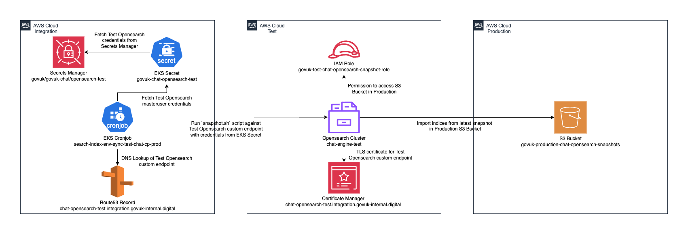

# 5. Test Opensearch Cluster

Date: 2025-02-25 (initially drafted in July 2024)

## Context
There is a requirement to have a clone of the production search index of GOV.UK Chat to be publicly available on AWS (with user credentials) for a couple of scenarios:
- To be used as search index for Heroku preview applications
- Available to the data scientists and developers for experimentation and local development

This should be updated each night with an export of indices from our Production Chat Opensearch Cluster.

## Decision
The new Opensearch cluster will be:
- Built in our Test AWS Account
- Built manually using the AWS Console
- Configured with a public endpoint for access from Heroku and Developers
- Built to the same specification as Production, with the exception of having a public endpoint rather than being in a VPC
- Configured with a custom endpoint for access from the required snapshot cronjob in Integration
- Built without any restriction by IP address for access to the endpoint
- Tagged along with any other resources created for it in the Test Account

Two sets of credentials will be created:
- One with read-write permissions to allow the Kubernetes cronjob to trigger the import job
- One with read-only permissions for the Developers and Heroku to use

Both sets of credentials will be stored in Secrets Manager in the Integration AWS Account, and the cronjob to trigger the import will be configured in there as well. Any modifications to existing resources or additional resources in Integration, Staging or Production accounts will be configured in Github and deployed by Terraform or ArgoCD as appropriate. The Production Snapshot S3 Bucket will be used for the imports so that the latest data is available.

Workflow to copy indexes from Production S3 bucket into Test Opensearch cluster:

[Diagram source](https://drive.google.com/file/d/1pP-prn7iKhXYyczM2O3QfzFun7gXfYPF/view?usp=drive_link)

### Rationale
Currently there is no infrastructure in place to automatically deploy resources into the Test account, so it makes sense in this instance to manually create. If anything is accidentally deleted/destroyed, nothing should be dependent upon the cluster and it can easily and quickly be rebuilt. 

## Status
accepted

## Consequences
If any of the resources in the Test account get deleted, they will need to be recreated manually. Using the Custom Endpoint will prevent having to do any reconfiguration of the Snapshot import job, although the `test_opensearch_url` variable will need to be updated in `govuk-infrastructure/terraform/deployments/tfc-configuration/variables-integration.yaml`.
